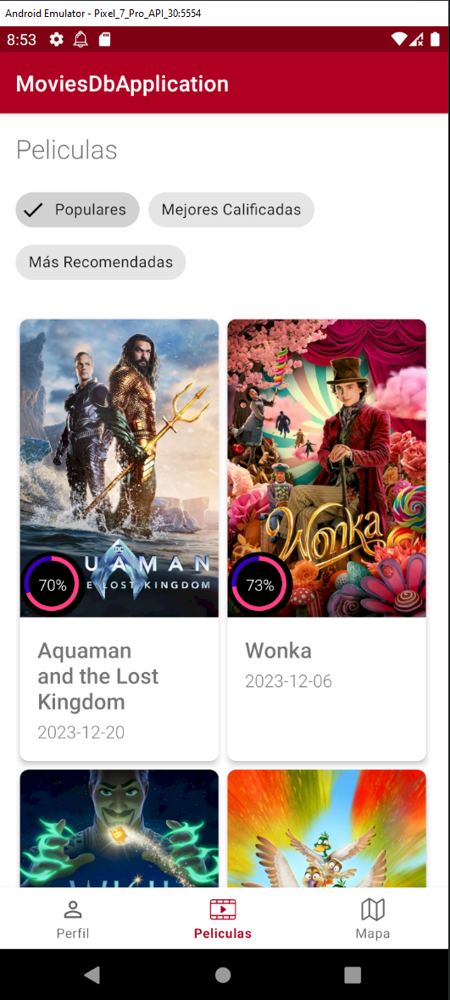
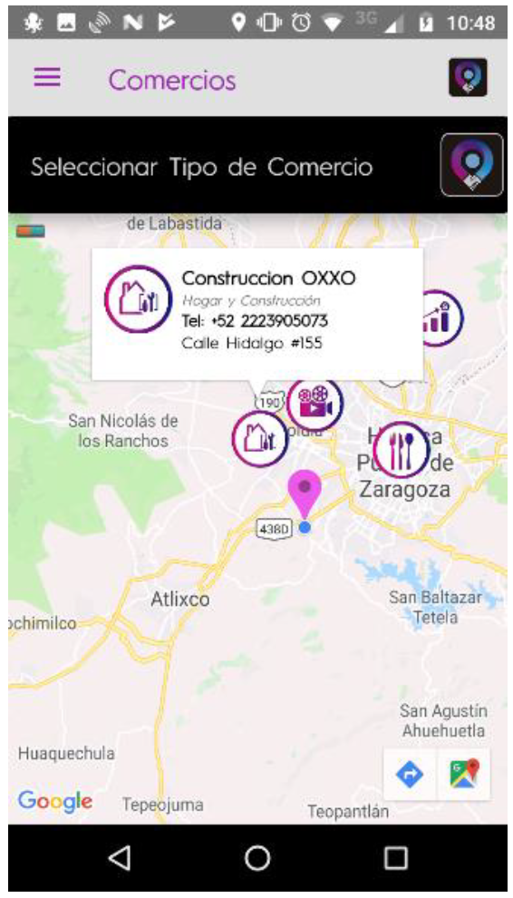

# Movies DB Application

Prueba técnica de Android para la aplicación Movies DB. Este proyecto implementa la arquitectura MVVM, Inyección de dependencias (Hilt), Coroutinas, Base de datos, Firebase, Maps, y otros elementos.

## Faltantes del Proyecto

- 

### Pantalla 1

- **Guardar Comentarios:** Implementar la funcionalidad para guardar comentarios relacionados con las películas.
  
- **Mostrar Imágenes:** Desarrollar la capacidad de mostrar imágenes asociadas a las películas.

- **Guardar datos offline:** Implementar el almacenamiento local para acceder a los datos incluso sin conexión a Internet.

### Pantalla 2

- **Paginación al hacer Scroll:** Implementar paginación para cargar más resultados a medida que el usuario hace scroll en la lista de películas.

- **Mostrar más detalles:** Al hacer clic en un elemento de la lista, mostrar detalles adicionales de la película.

### Pantalla 3

- **Guardar datos Offline:** Habilitar el almacenamiento local para la información en esta pantalla.

- **Crear un servicio o Flow:** Establecer un servicio o Flow para obtener datos de manera eficiente.

### Pantalla 4

- **Vista completa:** Completar la implementación de la vista para ofrecer una experiencia completa.

## Cosas que Mejorar

Además de los faltantes mencionados, hay áreas de mejora en el proyecto:

- **Agregar un Login:** Implementar un sistema de inicio de sesión para asociar un ID a los usuarios y permitirles guardar sus datos.

- **Guardar datos de forma local:** Extender la funcionalidad de almacenamiento local para abarcar más secciones de la aplicación.

- **Diseño de UI:** Mejorar la estética general de la interfaz de usuario para una experiencia más atractiva.

- **Sección del mapa:** Agregar una lista para mostrar ubicaciones en el mapa y redirigir solo al elemento seleccionado. Mejorar la vista de detalles del marcador para una presentación más atractiva. Como las siguientes imagenes
- 


- **Geolocalización:** Justificar y documentar el seguimiento de ubicación, explicando el motivo y la ejecución de servicios en segundo plano. [Proyecto donde he aplicado la geolocalizacion en background](https://www.youtube.com/shorts/N9URjBGrN6Q)

¡Gracias por revisar el proyecto! Si tienes alguna sugerencia o pregunta, no dudes en compartir tus comentarios.
```
